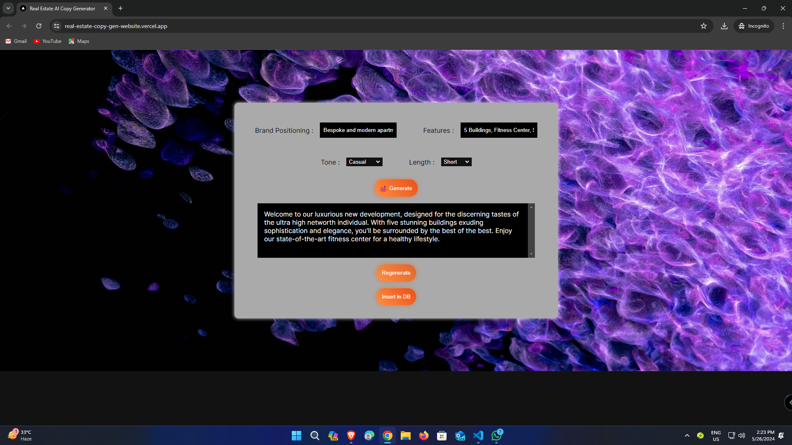

# AI based Website for Real Estate Marketing Copy Generation
## This website has been deployed and is currently live at Vercel -> [Link](https://real-estate-copy-gen-website.vercel.app/) 
### Documentation (Please Read Carefully)

# Generating Marketing Copy
* ### First enter the brand positioning in the provided text box
* ### Then enter Features in the provided box

`
NOTE: You can't leave the above two fields black, if you do then you will be greeted with a notification asking you to fill them first
`

* ### Then you can select the tone and the length options from the given downdowns

* ### Finally click on the generate button and wait for the AI to generate the text

`
NOTE: Generating text from AI LLM can occasionally take some more time so, please be patient. If there is any error in generation you will be notified about the same.
`

# Re-Generating Marketing Copy (If needed)

* ### Once the text is generated, you can select (or highlight) any specific part of it.

* ### As you do so, immediately a drop-down will appear and it will have two options namely "Make it Shorter" &amp; "Make it Longer"

* ### Click on the appropriate button from the drop-down &amp; then click on the Regenerate button to regenerate the text

`
NOTE: Clicking on the regenerate button without selecting any part of the text or without selecting anything from the drop-down will simply not work and you will be notified about it by an error message.
`

# Adding all the details to the database

### Once you are happy with the output, you can click on the Insert in DB button to Insert the details into the database.

`
NOTE: Make sure none of the fields are empty otherwise data will not be inserted into the database and you would be notified about the same with an error message.
`

# Knows Issues

`
NOTE: These bugs are already known but will be addressed later on
`

### In some mobile devices the default text selection browser pop-up interfaces with the website script. Although this is not a major issue the website is still completely usable on mobile devices but the pop-up might not appear it correct position.